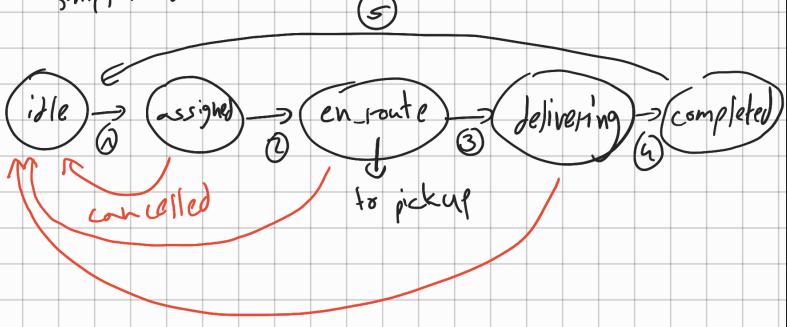
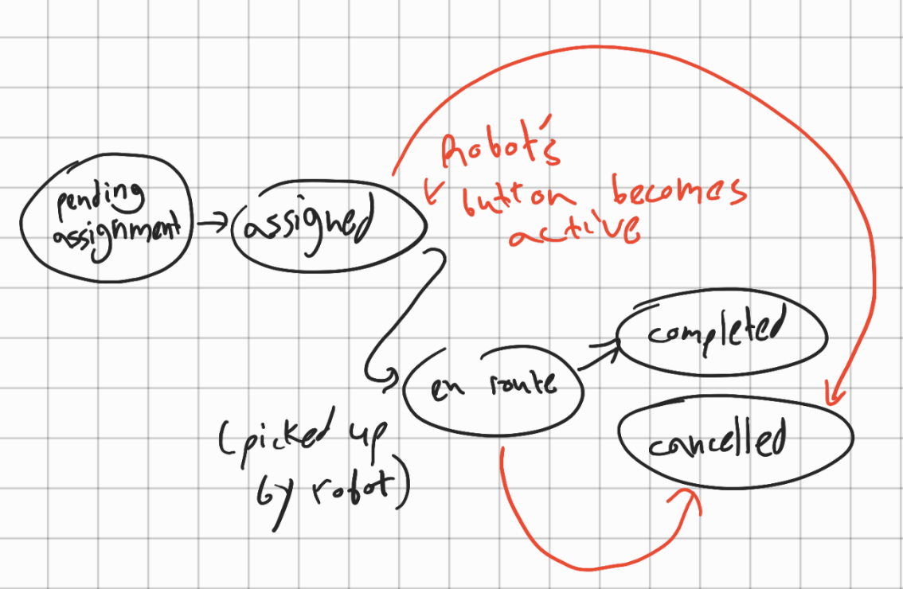
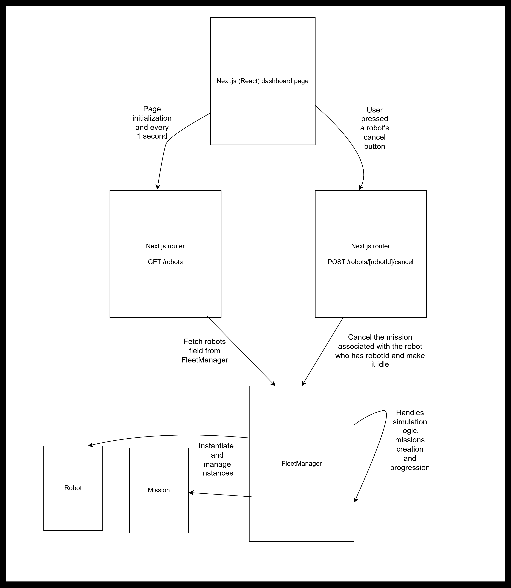

# FleetOps Dashboard

### How to run

```bash
npm run dev
```

Open [http://localhost:3000](http://localhost:3000) with your browser to see the result.

### Tech Stack

Node.js + [Next.js](http://next.js) + React + Tailwind CSS

### Assumptions

- All missions have the same priority. Mission pipeline behaves FIFO where a mission on the top of the queue is picked up by the first idle robot.
- Robots pick up deliveries at a single location and drop off at a single location. These two locations are not the same.
- Robots idle at the end point so that en_route performs the route delivery point -> pickup point and delivering performs the route pickup point -> delivery point.
- Route conditions are the same every time so that once a robot gets assigned it takes the exact same time to complete delivery as long as the user doesn’t cancel the delivery while it’s in progress.
- Mission and Robot id’s are assigned numbers in ascending order for simplicity. In a real scenario they would be generated in DB using CUID, UUID or similar.
- We assume errors are impossible during the delivery pipeline for simplicity. Deliveries can only end with a successful delivery (completed state) or with a user caused cancellation.
- Cancelled/completed missions are removed from memory to reduce memory usage. Trade off: in a real scenario it would be best to save those in a database for logging, observability, stats etc.
- In a real world scenario cancellation during transit would require returning the robot to a hub or a base and handling a partial route timing that varies dynamically upon the robot's location. Since this is a simulation, we'll just assume that robot whose mission was cancelled return to idling at their spot instantly.
- The timings are short for the sake of simulation. Around only 4 robots are active at a time given the 2 missions per minute generation rate. Longer times would hinder the simulation and would be too slow to observe.

### States

###### 1. Robot



###### 2. Mission



### Timings

I decided on the following timings between each mission state:

1. Pending assignment -> Assigned. Dynamic. If there exists an idling robot instantaneous which in this simulation is the most likely.
2. Assigned -> En Route. 5 seconds overhead for planning route.
3. En Route -> Delivering. Time that takes a robot to get from Idle point (delivery end point) to pickup point. 50 seconds including pickup overhead of 5 seconds.
4. Delivering -> Completed. Time that takes a robot to get from pickup point to delivery end point. 45 seconds.
5. Completed -> Idle. 5 seconds hand off delivery overhead.

### Architecture



The page polls every second to update its robots' states on the frontend. On the backend those states are managed by singleton class FleetManager. This class instantiates the robots in the fleet and is also responsible for instantiating missions, assigning them to robots making the simulated robots and missions move between states as time passes as planned in the FSM. The intervals between states timed as described above and every second we evaluate whether state should be changed using the time stamp when status was last changed and the defined timings for each state.  
The robots' cancel button is only enabled if the corresponding robot currently has a mission and has not completed it yet (aka one of the states "assigned", "en_route", "delivering"). Upon clicking that button FleetManager will reset the robot's state back to "idle" and will delete the mission from memory.

### Tests I'd Run

- All existing robots should be presented on the dashboard with their correct information (status, mission id if they have one, etc).
- A robot’s cancel button should only be enabled if the robot is currently assigned to a mission. Meaning when its status is either assigned, en_route or delivering.
- Pressing a robot’s cancel button should clear out its status and make it idle, as well as clearing out its mission id (as a result of those the cancel mission button should become inactive as well).
- If a robot completes its mission, status should become idle, mission id should be cleared out (as a result of those the cancel mission button should become inactive as well).
- 2 new missions should be created every one minute.
- Timing between states is consistent with the state transition time as defined.

### AWS

My current system struggles to scale because of the FleetManager singleton and the in memory nature of the excercise. The reason for this is the fact that all of the robots are instantiated and managed inside the FleetManager instance in the memory, making each instance of FleetManager and its robot isolated from any other instances of that class.

With this implementation I'd use EC2, ECS and ALB with Route 53.  
EC2 will be used to run ECS and ECS will run the containers that have the app on them (monolith).  
This way we have the option to either scale vertically by upgrading EC2 or horizontally by creating other containers to run the app. We can use sharding and split robots by id's so that for example container 1 manages robots 0-99 and container 2 manages robots 100-199 and so on as we scale the size of the fleet.  
ALB will route incoming requests from the page based in the robot ID given in the url to the correct container containing the correct robot with the robot id. Route 53 assigns a human readable domain and points it to the ALB, which routes requests to the correct container based on the robot ID in the URL.

So communication goes Browser -> ALB -> ECS -> FleetManager instance -> Response
